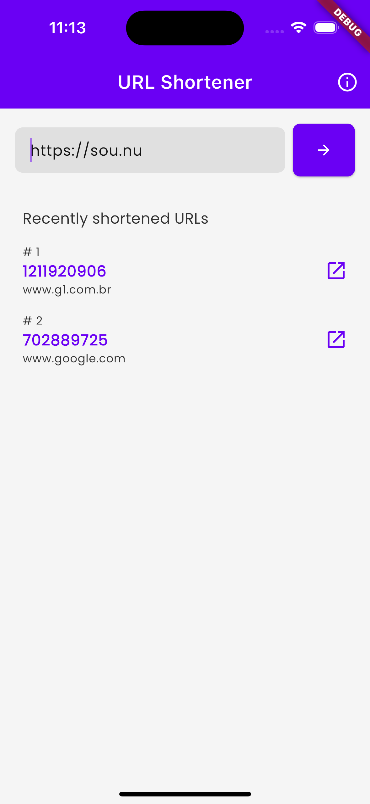
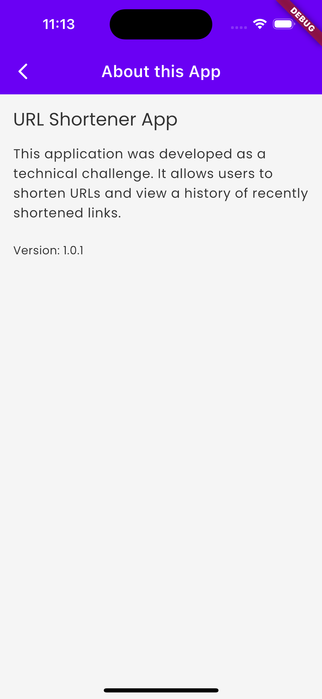
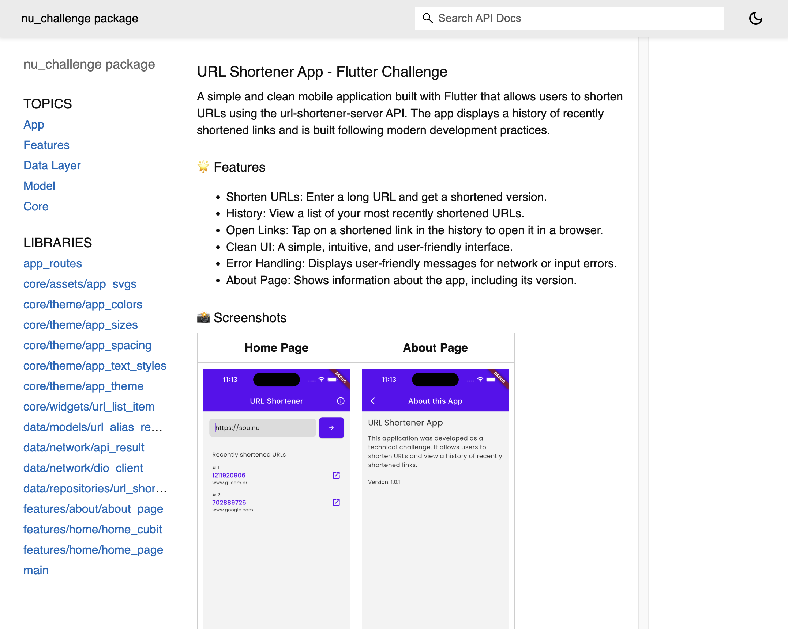
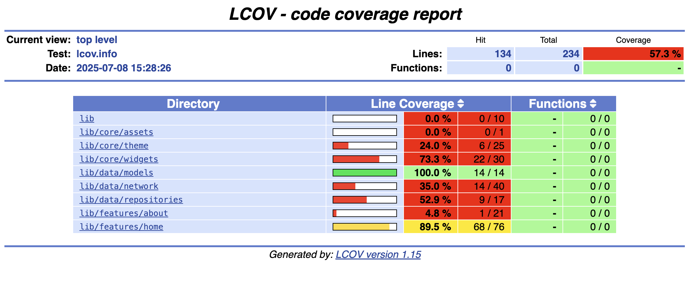

## URL Shortener App - Flutter Challenge

A simple and clean mobile application built with Flutter that allows users to shorten URLs using the url-shortener-server API. The app displays a history of recently shortened links and is built following modern development practices.

---

### 🌟 Features

* **Shorten URLs:** Enter a long URL and get a shortened version.
* **History:** View a list of your most recently shortened URLs.
* **Open Links:** Tap on a shortened link in the history to open it in a browser.
* **Clean UI:** A simple, intuitive, and user-friendly interface.
* **Error Handling:** User-friendly messages for network or input errors.
* **About Page:** Information about the app, including its version.

### 📸 Screenshots

|                 Home Page                |                 About Page                |
| :--------------------------------------: | :---------------------------------------: |
|  |  |

---


### 🏗️ Tech Stack & Architecture

This project is built with a focus on scalability, maintainability, and clean code principles.

#### Architecture

* **State Management:** [`flutter_bloc`](https://pub.dev/packages/flutter_bloc) (specifically using Cubit) to manage the application's state in a simple and predictable way. The UI reacts to state changes emitted by the `HomeCubit`.
* **Repository Pattern:** Decouples the data layer from the rest of the application. The `UrlShortenerRepository` abstracts the data source (network API) and provides a clean interface for the business logic (`HomeCubit`) to interact with.
* **Dependency Injection:** `RepositoryProvider` is used to make the `UrlShortenerRepository` available to the widget tree, specifically for the `HomeCubit` to access.
* **Network Layer:** [`dio`](https://pub.dev/packages/dio) is used for making HTTP requests. A `DioClient` class is set up to handle base configurations, such as the base URL and interceptors for logging in debug mode.
* **Sealed Classes for API Results:** The `ApiResult` sealed class (`Success` and `Failure`) is used to handle API responses gracefully, ensuring that both success and error states are explicitly managed.

---

#### Core Technologies

* **Framework:** Flutter
* **Language:** Dart

---

#### Main Dependencies

* `flutter_bloc`: For state management
* `dio`: HTTP client for Dart
* `url_launcher`: To launch URLs in the device's default browser
* `package_info_plus`: To get app version information for the 'About' page
* `google_fonts`: For custom fonts such as 'Poppins'
* `flutter_svg`: To render SVG assets

---

### 📁 Project Structure

This project follows a feature-driven directory structure for organization and scalability.

```
lib/
├── app_routes.dart           # Manages navigation and routes
├── main.dart                 # Main entry point of the application
│
├── core/                     # Shared code, widgets, and utilities
│   ├── assets/               # Asset constants (e.g., SVG paths)
│   ├── theme/                # App-wide theme, colors, text styles, sizes
│   └── widgets/              # Reusable custom widgets (e.g., UrlListItem)
│
├── data/                     # Data layer
│   ├── models/               # Data models (e.g., UrlAliasResponse)
│   ├── network/              # Network client (Dio) and API result handling
│   └── repositories/         # Repository implementations
│
└── features/                 # Feature-based modules
    ├── home/                 # Home feature (includes cubit, state, and page)
    └── about/                # About feature (page)
```

---

### 🚀 Getting Started

#### Flutter Version

```
Flutter 3.32.5 • channel stable • https://github.com/flutter/flutter.git
Framework • revision fcf2c11572 (2 weeks ago) • 2025-06-24 11:44:07 -0700
Engine • revision dd93de6fb1 (2 weeks ago) • 2025-06-24 07:39:37 -0700
Tools • Dart 3.8.1 • DevTools 2.45.1
```

---

#### Install dependencies

```sh
flutter pub get
```

#### Run the application

```sh
flutter run
```

---

### 📁 Documentation



To generate documentation:

```sh
dart doc .
```

To run a local HTTP server for documentation (so the search function works):

```sh
dart pub global activate dhttpd
dhttpd --path doc/api
# Navigate to http://localhost:8080 in your browser.
```

---

## 🧪 Testing

### Unit and Widget Tests

Some unit and widget tests were developed to ensure code quality.

To run tests:

```sh
flutter test
```

---

### Integration Tests

To run integration tests:

```sh
flutter drive --driver=test_driver/integration_test.dart --target=integration_test/app_test.dart
```

Screenshots are saved in the `screenshots/` folder.

> **Warning:** These tests make real network calls to your API. Make sure your backend (url-shortener-server.onrender.com) is up and accessible when running these tests.

---

### Test Coverage



To collect test coverage information:

```sh
flutter test --coverage
```

The result is saved in `coverage/lcov.info`.
If you have the `lcov` tool installed (`brew install lcov` on Mac), you can generate a coverage report using:

```sh
genhtml -o coverage coverage/lcov.info
# To open in the default browser (Mac):
open coverage/index.html
```

#### Test Coverage Badge

To generate a coverage badge:

```sh
flutter pub run test_coverage_badge
```

saved as `coverage_badge.svg` in root folder

---


### 📜 License
This project is open source. The fonts used are under the OFL (Open Font License).